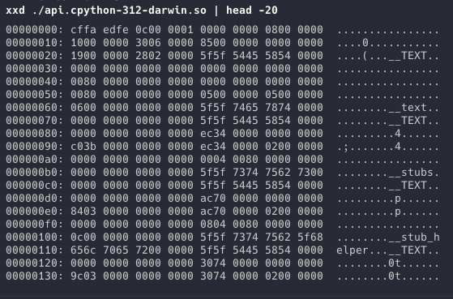
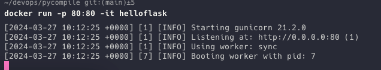
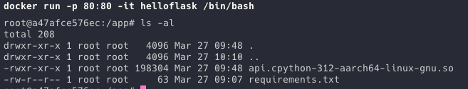

# "IP Protecting" python code with Cython and Docker

I was looking for a method to distribute some proprietary code to 3rd parties with some level of IP protection. Knowing
that this is a losing battle, and that I suspected that it was more about limiting curiosity rather than deliberate
reverse engineering, I decided to investigate the use of cython to compile python via C into a binary.

This repo demonstrates the process of building a Flask app into a Docker container with a compiled binary of the
application. It also uses a multi-stage docker build to ensure that the original source files are never copied into the
target image.

For a more thorough obfuscation, I would suggesting looking into using a more robust solution such as
this: https://github.com/0sir1ss/Anubis

## Manually building the binary with cython

```
pip install -r requirements.txt
python setup.py build_ext --inplace
```

### Confirming the binary is built

As you can see, the binary is compiled as a shared object fil, the following screenshot shows a hex dump of this file.
Although it would be possible to reverse engineer this file, the effort required to do so would be considerable.



### Running the local binary with gunicorn

```
gunicorn api:app
```

## Building the image for docker

### Build single-arch image, load to local docker

```
docker buildx build --platform linux/arm64 --load --tag helloflask .

docker buildx build --platform linux/amd64 --load --tag helloflask .
```

### Build multi-arch image

```
docker buildx build --platform linux/arm64,linux/amd64 --tag helloflask .
```

## Running the image

```
docker run -p 80:80 -it helloflask
```



## Confirming the binary is in the image

